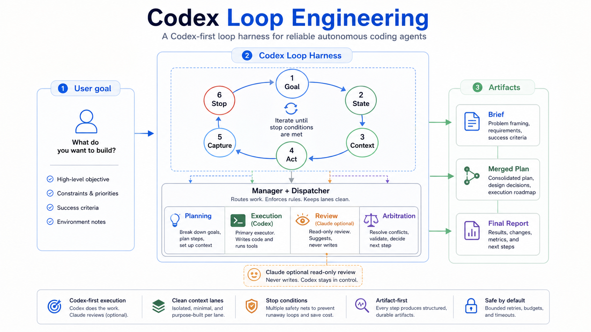
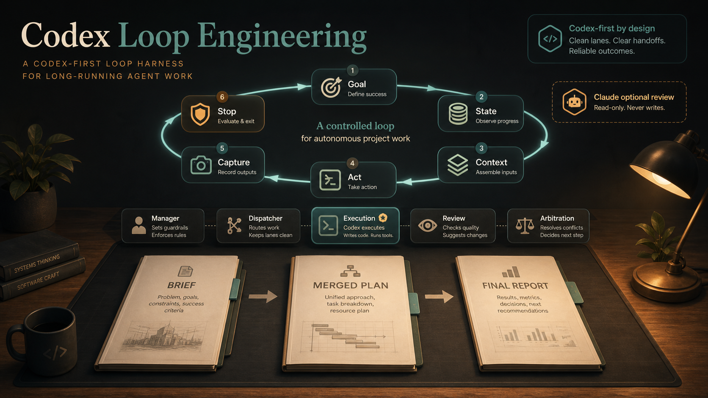

# Codex Loop Engineering

[English](README.md) | [简体中文](README.zh-CN.md)

Codex Loop Engineering is a Codex plugin for substantial work that benefits from explicit planning, execution, review, arbitration, and repair loops.

Use it when a single pass is likely to miss edge cases: deep refactors, large feature work, architecture-affecting fixes, research synthesis, product/design workflows, multi-file migrations, or recurring processes that need artifact-backed coordination.

It is intentionally narrower than Superpowers. Superpowers is a broad development methodology with many composable skills. Codex Loop Engineering is one focused plugin for long-running Codex-centered coordination: choose the smallest route that controls risk, write durable artifacts, keep independent reviews independent, and stop with evidence.





## Why This Exists

Loop engineering is the difference between repeatedly prompting an agent and giving the work a controlled lifecycle.

Most long-running agent runs fail for predictable reasons:

- no done check, so the agent does not know when to stop;
- no capture step, so the next round forgets what happened;
- no feedback path, so failures do not change the next input;
- no durable state, so each round cold-starts the project again;
- no stop condition, so cost, risk, or production changes can run away.

Codex Loop Engineering turns those failure points into explicit interfaces: `goal`, `state`, `context`, `act`, `capture`, and `stop`.

## Core Differentiators

- **Codex-first loop harness**: designed for developers who primarily work in Codex, with Codex owning execution, arbitration, and final verification.
- **Lifecycle control, not just prompting**: every loop defines what it is trying to do, what state it reads, how state becomes context, what the agent may do, what gets captured, and when the loop stops.
- **Manager-routed lane work**: manager and dispatcher lanes track artifacts, deadlines, identities, and handoffs instead of turning the project into an unstructured group chat.
- **Clean context boundaries**: planning, execution, review, arbitration, manager, and dispatcher lanes each get role-scoped context, reducing cross-agent contamination.
- **Single-line communication between lanes**: handoffs are artifact-first and directed; review lanes do not read each other before arbitration.
- **Configurable role topology**: the framework gives you the orchestration shell, but the actual agent names, counts, and task split are chosen per project instead of being hardcoded.
- **Codex + Claude optional cross-checking**: Claude can be used for planning or read-only review when available, but the workflow stays Codex-centered and includes honest Codex-only fallback paths.
- **Reusable skill and harness accumulation**: repeated workflows can be promoted into skills, context packs, checkers, and forward tests instead of being rediscovered each time.
- **Semi-automated monitoring**: long-running lanes can declare `check_after`, `deadline`, blocker signals, and state artifacts so monitoring is bounded rather than constant polling.

## Role Topology

Loop engineering is a framework for choosing how many agents to use, what they should be called, and how they should communicate. The project owner decides the task plan; this plugin helps turn that plan into a controlled lane graph.

Typical topology choices include:

- **Manager-worker**: one manager lane coordinates several execution lanes and one or more review lanes.
- **Fan-out / fan-in**: one prompt splits into parallel reads or builds, then merges into one integration lane.
- **Linear pipeline**: research, draft, execute, review, publish.
- **Review loop**: execute first, then inspect with a fresh reviewer before arbitration.
- **Hybrid parallel execution**: parallel subtasks for research, assets, or data prep, followed by a single integration lane.

For every new task, the loop should first derive the project-specific roles, then build the matching identity table and worklog summary for those roles. If the task changes, the role map and worklog schema should change with it.

The main rule is simple: keep role names project-defined, keep contexts clean, and prefer the smallest topology that still lets the work move safely. When the loop reaches a decision point the user should own, or when the agent is uncertain, stop and ask instead of running indefinitely.

## What It Provides

- Route tiers from direct current-thread work to full multi-lane loops.
- A six-interface contract: goal, state, context, act, capture, and stop.
- Artifact protocols for briefs, plans, execution reports, reviews, arbitration, and final reports.
- Claude/Codex review guidance with honest Codex-only fallback paths when Claude is unavailable.
- State and feedback schemas so future agents do not rediscover the same facts from chat history.
- Helper scripts for launching visible Claude Terminal lanes and validating Strategic Loop Contracts.

## Install

This repository is arranged as a Codex marketplace source. The installable plugin lives under `plugins/codex-loop-engineering`.

### Marketplace Install

Register this repository as a marketplace source:

```bash
codex plugin marketplace add https://github.com/liujiazhi-arch/codex-loop-engineering
```

Install the plugin from the new marketplace:

```bash
codex plugin add codex-loop-engineering@codex-loop-engineering
```

### Local Fallback

If your Codex environment does not yet support marketplace installs, clone the repository and use the packaged plugin under `plugins/codex-loop-engineering`.

If your Codex environment does not yet support plugins, copy `skills/loop-engineering` into your Codex skills directory. The plugin metadata and icon will not be used, but the skill workflow still works.

## Quick Start

Ask Codex to use the skill:

```text
Use Codex Loop Engineering for this refactor.
```

Before the first lane starts, the plugin should ask the user to define the topology:

- What outcome are we aiming for, and what counts as good enough?
- Which roles or agents do you want, and should those names be project-specific?
- Which parts should run in parallel, and which must stay sequential?
- How should the agents communicate: manager-mediated only, direct handoff, review-only, or mixed?
- Do you want Codex only, or Codex plus optional Claude review/planning lanes?
- Which points should always trigger a user checkpoint instead of autonomous continuation?

If the user has not answered those questions yet, the skill should pause instead of inventing a fixed role layout.

Typical artifact bundle:

```text
docs/loop-engineering/YYYY-MM-DD-slug/
  00-brief.md
  10-plan-claude.md
  11-plan-codex.md
  12-plan-merged.md
  20-execution-report.md
  30-review-claude.md
  31-review-codex-subagent.md
  40-arbitration.md
  50-final-report.md
```

For smaller tasks, the skill should downgrade to a checklist or direct current-thread work instead of creating unnecessary lanes.

## Example Loop Shape

A slow database-query optimization loop might look like this:

1. **Goal**: reduce query latency without changing production data.
2. **State**: read prior query logs, attempted indexes, execution plans, and benchmark results.
3. **Context**: generate the next prompt from the current state and accepted feedback.
4. **Act**: propose an optimization and run it against a safe benchmark environment.
5. **Capture**: record SQL/index changes, timing results, costs, and regressions.
6. **Feedback**: if the benchmark misses the target, write the comparison back into state.
7. **Stop**: stop when latency reaches target, round/budget cap is hit, or production risk appears.

The point is not that every task needs a loop. The point is that a task worth looping should not be left to memory and vibes.

## Basic Workflow

1. **Route selection**: choose T0 through T5 before creating lanes.
2. **Contract**: define goal, state, context, act, capture, and stop.
3. **Planning**: create a brief and, for risky work, independent plans plus a merged plan.
4. **Execution**: Codex executes the merged plan inside the accepted scope.
5. **Review**: use independent Claude/Codex review when the route requires it.
6. **Arbitration and repair**: accept or reject findings by evidence, repair in scope, and verify.
7. **Final report**: close only with changed files, review dispositions, verification output, and residual risks.

## What's Inside

- `skills/loop-engineering/SKILL.md`: core workflow and route tiers.
- `references/claude-policy.md`: Claude lane policy, lifecycle, fallback, and evidence rules.
- `references/lane-roles.md`: planning, execution, review, arbitration, manager, and dispatcher roles.
- `references/strategic-loop-contract.md`: strategic and operational contract schema.
- `references/state-feedback-schema.md`: event schema for multi-round state and feedback.
- `references/user-checkpoints.md`: when to stop for user decisions.
- `references/forward-tests.md`: pressure scenarios for future skill revisions.
- `scripts/validate-loop-contract.py`: lightweight contract checker.
- `scripts/launch-claude-terminal-lane.py`: macOS helper for visible Claude Terminal lanes.

## Requirements

- Codex with plugin and skill support.
- Python 3 for bundled helper scripts.
- Optional: Claude CLI if you want Claude planning or review lanes. The skill includes Codex-only independent planning/review fallback guidance when Claude is not available.
- Optional on macOS: Terminal automation for visible named Claude lanes.

## When Not To Use It

Do not use a full loop for every task. It costs extra tokens, creates more artifacts, and adds coordination overhead.

Use direct Codex work instead for:

- tiny local fixes;
- simple config or docs edits;
- one-file patches with obvious verification;
- questions or read-only explanations;
- tasks where a checklist is enough.

Use Codex Loop Engineering when the cost of losing state, mixing contexts, skipping review, or running without stop rules is higher than the orchestration overhead.

## Helper Scripts

Validate a Strategic Loop Contract:

```bash
python3 skills/loop-engineering/scripts/validate-loop-contract.py <contract-or-merged-plan.md>
```

Preview a Claude Terminal lane command without launching it:

```bash
python3 skills/loop-engineering/scripts/launch-claude-terminal-lane.py \
  --lane-id review-lane \
  --packet path/to/packet.md \
  --cwd "$PWD" \
  --dry-run
```

## Privacy

This plugin does not include API keys, private endpoints, or third-party gateway code. It is a workflow plugin; generated project artifacts may contain sensitive project details, so review artifacts before sharing them publicly.

## Development

Run the local checks before publishing changes:

```bash
python3 /path/to/plugin-creator/scripts/validate_plugin.py .
python3 /path/to/skill-creator/scripts/quick_validate.py skills/loop-engineering
python3 -m py_compile skills/loop-engineering/scripts/*.py
```

The GitHub Actions workflow compiles helper scripts and checks for common private-path or secret patterns.

## Updates

This repository does not auto-sync installed Codex plugins just because GitHub changed.

After a new commit is pushed:

```bash
codex plugin marketplace upgrade codex-loop-engineering
codex plugin add codex-loop-engineering@codex-loop-engineering
```

Then start a new thread so Codex loads the refreshed plugin package and skills.

## Contributing

Issues and pull requests are welcome. For behavior changes, include:

- the workflow failure or improvement being addressed;
- the route tier or lane behavior affected;
- updated examples or forward-test notes when relevant;
- evidence from validation commands.

Keep the plugin focused on Codex-centered loop orchestration. New broad development-methodology skills should usually live in another plugin rather than expanding this one.

## Community

- Issues: https://github.com/liujiazhi-arch/codex-loop-engineering/issues
- Repository: https://github.com/liujiazhi-arch/codex-loop-engineering

## License

MIT. See [LICENSE](LICENSE).
